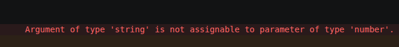

# Atividades

## Exercício: casos de teste

### O que foi feito

- Definimos um tipo `CasoDeTeste` com as propriedades:
  - `id: number`
  - `titulo: string`
  - `descricao: string`
  - `automatizado: boolean`
- Criamos a função `criarCasoDeTeste(...)` para montar um objeto do tipo correto.
- Criamos a função `descrever(...)` para formatar a saída em texto.
- Criamos a função `marcarAutomatizado(...)` para alterar o valor da propriedade `automatizado`.

### Como rodar

No terminal, na raiz do projeto, execute:

```bash
npm install
npm run dev:casosdeteste
```

Ou diretamente:

```bash
npx tsx src/atividades/casos-de-teste.ts
```

> Esse comando usa `tsx` para executar o arquivo TypeScript. O projeto também possui a checagem de tipos com `npm run type-check`.

### Erro de tipo provocado



Foi intencionalmente introduzido um erro de tipagem ao chamar a função assim:

```ts
const primeiroCasoDeTeste = criarCasoDeTeste("1", "Autenticação", "Login via número de telefone e código de verificação (SMS)", false);
```

O problema é que o primeiro parâmetro `id` foi passado como string, mas a tipagem exige `number`:

```ts
id: number
```
